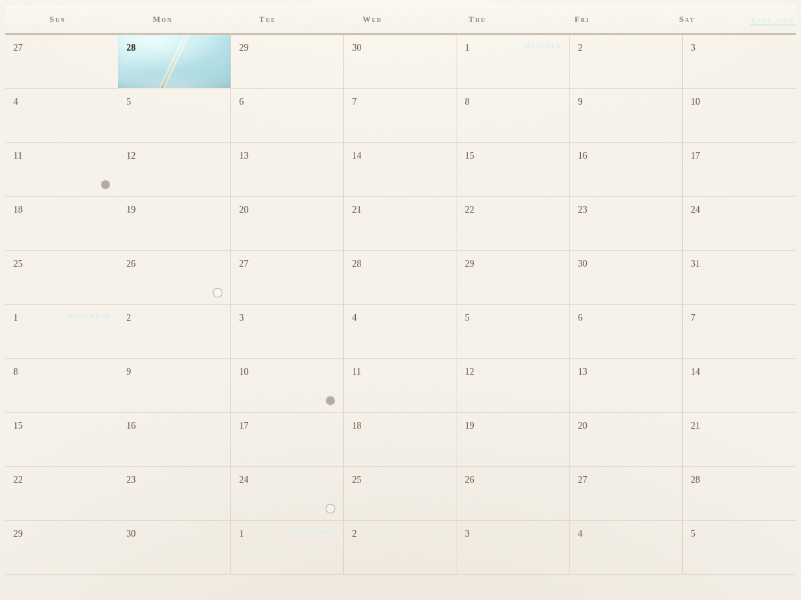
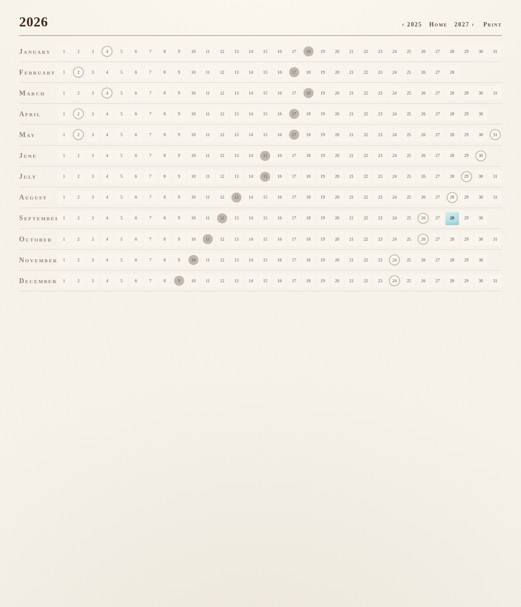

# Mooncal

A lunar calendar built with Ruby on Rails. It shows the new and full moon phases
on an infinite-scrolling weekly calendar and a printable year-at-a-glance sheet.

Phases are computed with a lightweight mean-synodic-month algorithm
(`app/models/moon_phase.rb`) — no external ephemeris data required.



## Requirements

* Ruby 4.0.7 (see `.ruby-version`)
* Rails 8.1
* SQLite 3 (default database)

## Getting started

```bash
bin/setup        # install gems, prepare the database
bin/dev         # start the dev server
```

Then visit http://localhost:3000.

## Features

* **Week view** — the current five weeks of days, with new/full moon markers.
  Scrolling to the bottom appends the next batch of weeks via a Turbo +
  Stimulus infinite-calendar controller (`/calendar/weeks?date=...&direction=newer`).
* **Year view** — all twelve months of a year with moon phases, ready to
  print (`/calendar/year?year=YYYY`). Years 1900–3000 are supported.



## Routes

| Path | Description |
| --- | --- |
| `/` | Current weeks (home) |
| `/calendar/weeks` | Week batches for infinite scroll |
| `/calendar/year?year=YYYY` | Full-year lunar sheet |
| `/up` | Health check |

## Testing & quality checks

```bash
bin/rails test           # unit + integration tests
bin/rails test:system    # system tests
bin/rubocop             # style (37signals house style)
bin/brakeman             # security scan
bin/bundler-audit        # gem vulnerability audit
bin/ci                   # run the full CI pipeline locally
```

CI runs all of the above on every push and pull request (`.github/workflows/ci.yml`).

## Deployment

The app ships with a production-ready Dockerfile and [Kamal](https://kamal-deploy.org) support:

```bash
docker build -t lunar .
docker run -d -p 80:80 -e RAILS_MASTER_KEY=<value from config/master.key> --name lunar lunar
```

For Kamal, configure `config/deploy.yml` and run `kamal deploy`.